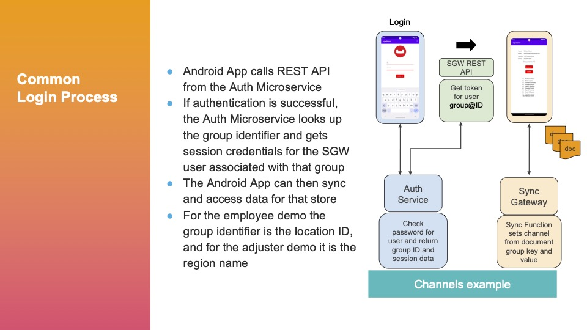

# Couchbase Android Sync Gateway Demo 3.1

Clone into Android Studio.

The password for all users is "password". To reset and start from scratch, use the "Clear App Data" button in the Settings activity (Note: the app will exit - this is expected).




## Employee Backend Container

To run the Sync Gateway, Couchbase Server, and Auth Microservice backend components for the employee demo use the [empdemo](https://hub.docker.com/r/mminichino/empdemo) container.
You can obtain a [helper utility](https://github.com/mminichino/employee-demo-container/releases/download/2.1.3/rundemo.sh) to run and manage the container.
Run the following to download the utility:
```
curl -L -O https://github.com/mminichino/employee-demo-container/releases/download/2.1.3/rundemo.sh
```
To build the container yourself, you can access the source here: [employee-demo-container](https://github.com/mminichino/employee-demo-container).

## Adjuster Backend Container

To run the Sync Gateway, Couchbase Server, and Auth Microservice backend components for the adjuster demo use the [adjdemo](https://hub.docker.com/r/mminichino/adjdemo) container.
You can obtain a [helper utility](https://github.com/mminichino/adjuster-demo-container/releases/download/1.0.1/rundemo.sh) to run and manage the container.
Run the following to download the utility:
```
curl -L -O https://github.com/mminichino/adjuster-demo-container/releases/download/1.0.1/rundemo.sh
```
To build the container yourself, you can access the source here: [adjuster-demo-container](https://github.com/mminichino/adjuster-demo-container).

### Notes
If you run the container on the same system running Android Studio (such as your desktop) use the system's IP address, not localhost (127.0.0.1).

To look at the documents in the database and their assigned channels, get a shell into the container and use the SGW CLI to dump the database:

```
% ./rundemo.sh --shell
root@ccb72cf9d6ee:/demo/couchbase# cd sgwcli/
root@ccb72cf9d6ee:/demo/couchbase/sgwcli# ./sgwcli database dump -h 127.0.0.1 -n employees
Key: employees:1 Id: employees:1 Channels: ['channel.store_id@1']
Key: employees:10 Id: employees:10 Channels: ['channel.store_id@1']
Key: employees:11 Id: employees:11 Channels: ['channel.store_id@2']
Key: employees:12 Id: employees:12 Channels: ['channel.store_id@2']
Key: employees:13 Id: employees:13 Channels: ['channel.store_id@2']
Key: employees:14 Id: employees:14 Channels: ['channel.store_id@2']
Key: employees:15 Id: employees:15 Channels: ['channel.store_id@2']
Key: employees:16 Id: employees:16 Channels: ['channel.store_id@2']
Key: employees:17 Id: employees:17 Channels: ['channel.store_id@2']
Key: employees:18 Id: employees:18 Channels: ['channel.store_id@2']
Key: employees:19 Id: employees:19 Channels: ['channel.store_id@2']
Key: employees:2 Id: employees:2 Channels: ['channel.store_id@1']
Key: employees:20 Id: employees:20 Channels: ['channel.store_id@2']
Key: employees:21 Id: employees:21 Channels: ['channel.store_id@3']
Key: employees:22 Id: employees:22 Channels: ['channel.store_id@3']
Key: employees:23 Id: employees:23 Channels: ['channel.store_id@3']
Key: employees:24 Id: employees:24 Channels: ['channel.store_id@3']
Key: employees:25 Id: employees:25 Channels: ['channel.store_id@3']
Key: employees:26 Id: employees:26 Channels: ['channel.store_id@3']
Key: employees:27 Id: employees:27 Channels: ['channel.store_id@3']
Key: employees:28 Id: employees:28 Channels: ['channel.store_id@3']
Key: employees:29 Id: employees:29 Channels: ['channel.store_id@3']
Key: employees:3 Id: employees:3 Channels: ['channel.store_id@1']
Key: employees:30 Id: employees:30 Channels: ['channel.store_id@3']
Key: employees:4 Id: employees:4 Channels: ['channel.store_id@1']
Key: employees:5 Id: employees:5 Channels: ['channel.store_id@1']
Key: employees:6 Id: employees:6 Channels: ['channel.store_id@1']
Key: employees:7 Id: employees:7 Channels: ['channel.store_id@1']
Key: employees:8 Id: employees:8 Channels: ['channel.store_id@1']
Key: employees:9 Id: employees:9 Channels: ['channel.store_id@1']
```

See [Sync Gateway CLI](https://github.com/mminichino/sgwcli) for details on using this utility.

The config.properties file contains default values that are imported when the app is first run.
| Property      | Description                                                    |
|---------------|----------------------------------------------------------------|
| sgwhost       | Hostname or IP address for Sync Gateway                        |
| database      | Database name configured in Sync Gateway                       |
| authEndpoint  | Hostname or IP address for Auth Microservice                   |
| demoList      | List of demos (employees,adjuster)                             |
| tagList       | List of group tags (store_id,region)                           |
| activeDemo    | Default demo (employees)                                       |
| groupTagField | Default group ID field (store_id)                              |
